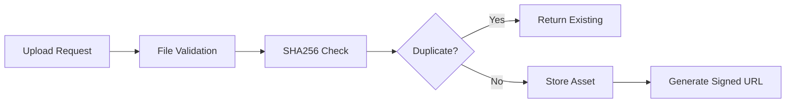
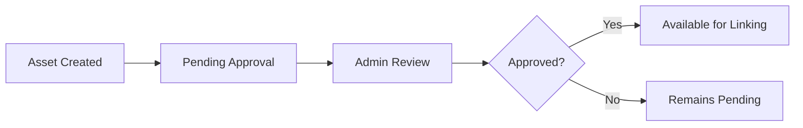
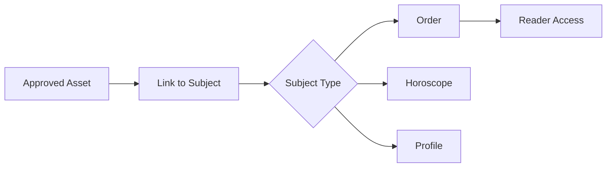

# M26 AR Experiments - Documentation

**Version**: 1.0  
**Status**: Production Ready (Admin Only)  
**Security**: Private storage with RLS; signed URLs; Admin-managed  

---

## Overview

The M26 AR Experiments module provides backend infrastructure for **Augmented Reality asset management** with secure storage, lineage tracking, and linking to readings. This is a **preparation module** with no UI dependency - all functionality is Admin-managed through APIs.

### Key Features

- **Secure Storage**: Private Supabase Storage buckets with signed URLs
- **Asset Validation**: File type, size, and content validation
- **Deduplication**: SHA256-based duplicate detection  
- **Linking System**: Connect AR assets to orders/horoscopes/profiles
- **Approval Workflow**: Admin approval required before use
- **Access Control**: RLS-first security with role-based access

---

## Architecture

### Components

1. **Database Schema** (`003_ar_i18n_schema.sql`)
   - `ar_assets`: Asset metadata and storage paths
   - `ar_links`: Asset-to-subject linking table
   - RLS policies for Admin/Reader access control

2. **Core Service** (`ar_service.py`)
   - File validation and hash calculation
   - Asset creation with deduplication
   - Linking management and approval workflows
   - Signed URL generation for secure access

3. **API Layer** (`ar_i18n_api.py`)
   - Admin-only endpoints for asset management
   - Upload, approval, and linking operations
   - Storage statistics and monitoring

4. **Test Suite** (`test_m26_ar.py`)
   - Asset validation and creation tests
   - Security and access control validation
   - Linking system verification

---

## Data Model

### AR Asset

```json
{
  "id": 12345,
  "owner_id": "uuid",
  "kind": "overlay|filter|effect|model|animation",
  "filename": "mystical_overlay.png",
  "content_type": "image/png",
  "sha256": "abc123...",
  "bytes": 245760,
  "duration_ms": null,
  "frame_count": null,
  "storage_path": "ar-assets/user-id/abc12345/mystical_overlay.png",
  "metadata": {"description": "Mystical tarot overlay"},
  "is_approved": false,
  "approved_by": null,
  "approved_at": null,
  "created_at": "2025-01-15T10:30:00Z"
}
```

### AR Link

```json
{
  "id": 67890,
  "ar_asset_id": 12345,
  "subject_type": "order",
  "subject_id": "98765",
  "link_position": {"x": 0.5, "y": 0.3, "z": 0.1},
  "is_active": true,
  "created_by": "admin-uuid",
  "created_at": "2025-01-15T10:35:00Z"
}
```

---

## API Endpoints (Admin Only)

### Upload AR Asset

```bash
POST /admin/ar/assets
Content-Type: application/json
Authorization: Bearer <admin-jwt>

{
  "kind": "overlay",
  "filename": "mystical_overlay.png",
  "content_base64": "iVBORw0KGgoAAAANSUhEUgAA...",
  "metadata": {
    "description": "Mystical overlay for tarot readings",
    "creator": "Design Team"
  }
}
```

**Response**: Asset metadata with signed upload URL

### List AR Assets

```bash
GET /admin/ar/assets?kind=overlay&approved_only=true&limit=20
Authorization: Bearer <admin-jwt>
```

**Response**: Paginated asset list with storage statistics

### Approve Asset

```bash
POST /admin/ar/assets/{asset_id}/approve
Authorization: Bearer <admin-jwt>
```

### Link Asset to Subject

```bash
POST /admin/ar/assets/link
Content-Type: application/json
Authorization: Bearer <admin-jwt>

{
  "ar_asset_id": 12345,
  "subject_type": "order",
  "subject_id": "98765",
  "link_position": {"x": 0.5, "y": 0.3, "z": 0.1}
}
```

### Get Links for Subject

```bash
GET /admin/ar/links/order/98765?active_only=true
Authorization: Bearer <admin-jwt>
```

---

## Security & Access Control

### RLS Policies

```sql
-- Admin/Superadmin full management access
create policy ar_assets_admin_full on ar_assets
  for all using (
    exists (
      select 1 from profiles p 
      where p.id = auth.uid() and p.role_id in (1,2)
    )
  );

-- Reader read-only access to linked assets  
create policy ar_assets_reader_linked on ar_assets
  for select using (
    exists (
      select 1 from ar_links al
      join orders o on al.subject_type = 'order' and al.subject_id::bigint = o.id
      where al.ar_asset_id = ar_assets.id
        and o.assigned_reader = auth.uid()
        and al.is_active = true
    )
  );
```

### Access Control Matrix

| Role | Upload | Approve | Link | View Own | View All | Delete |
|------|--------|---------|------|----------|----------|--------|
| Client | ❌ | ❌ | ❌ | ❌ | ❌ | ❌ |
| Reader | ❌ | ❌ | ❌ | ✅ (linked only) | ❌ | ❌ |
| Monitor | ❌ | ❌ | ❌ | ❌ | ❌ | ❌ |
| Admin | ✅ | ✅ | ✅ | ✅ | ✅ | ✅ |
| Superadmin | ✅ | ✅ | ✅ | ✅ | ✅ | ✅ |

---

## Storage Policy

### File Validation

- **Allowed Types**: PNG, JPEG, WebP, MP4, WebM, GLTF, GLB
- **Size Limit**: 50MB per file
- **Duration Limit**: 60 seconds for video/animation
- **Hash Deduplication**: SHA256-based duplicate detection

### Storage Structure

```
ar-assets/
  {user-id}/
    {sha256-prefix}/
      {original-filename}
```

**Example**: `ar-assets/user-123/abc12345/mystical_overlay.png`

### Signed URLs

- **Default TTL**: 1 hour
- **Admin TTL**: Configurable up to 24 hours
- **Reader TTL**: 30 minutes (for linked assets only)
- **Auto-rotation**: New URL on each request

---

## Asset Lifecycle

### 1. Upload & Validation



### 2. Approval Workflow



### 3. Linking System



---

## Operations

### Asset Management

```bash
# List pending approvals
curl -H "Authorization: Bearer $ADMIN_JWT" \
  "$API_BASE/admin/ar/assets?approved_only=false&limit=50"

# Batch approve assets
for asset_id in 123 124 125; do
  curl -X POST \
    -H "Authorization: Bearer $ADMIN_JWT" \
    "$API_BASE/admin/ar/assets/$asset_id/approve"
done

# Get storage statistics
curl -H "Authorization: Bearer $ADMIN_JWT" \
  "$API_BASE/admin/ar/assets" | jq '.stats'
```

### Storage Monitoring

Key metrics to monitor:
- Total asset count and approved ratio
- Storage usage and growth trends
- Upload success/failure rates
- Signed URL request frequency
- Asset link utilization

### Cleanup Operations

```sql
-- Remove unused assets (no active links, older than 90 days)
DELETE FROM ar_assets 
WHERE id NOT IN (
  SELECT DISTINCT ar_asset_id 
  FROM ar_links 
  WHERE is_active = true
) 
AND created_at < now() - interval '90 days'
AND is_approved = false;

-- Deactivate expired links
UPDATE ar_links 
SET is_active = false 
WHERE created_at < now() - interval '1 year';
```

---

## Integration Examples

### Link AR Asset to Order

```python
# After order completion, add AR enhancement
ar_service = ARService()

# Create link to completed order
link = ar_service.create_link(
    ar_asset_id=mystical_overlay_id,
    subject_type='order',
    subject_id=str(order.id),
    creator_id=admin_user_id,
    link_position={'x': 0.5, 'y': 0.2, 'z': 0.1}
)

# Generate signed URL for client access
if link:
    signed_url = ar_service.generate_signed_url(
        asset.storage_path, expires_in=3600
    )
    # Provide signed_url to client for AR rendering
```

### Reader Access to Linked Assets

```python
# Reader views assigned order with AR assets
def get_order_ar_assets(order_id, reader_id):
    # Check reader assignment (enforced by RLS)
    links = ar_service.get_links_for_subject('order', str(order_id))
    
    ar_assets = []
    for link in links:
        if link.is_active:
            asset = ar_service.get_asset_by_id(link.ar_asset_id)
            if asset and asset.is_approved:
                signed_url = ar_service.generate_signed_url(
                    asset.storage_path, expires_in=1800  # 30 min
                )
                ar_assets.append({
                    'asset': asset,
                    'link_position': link.link_position,
                    'signed_url': signed_url
                })
    
    return ar_assets
```

---

## Troubleshooting

### Common Issues

**Upload Failures**:
- Check file type against `ALLOWED_TYPES`
- Verify file size under `MAX_FILE_SIZE` (50MB)
- Ensure valid base64 encoding

**Access Denied**:
- Verify Admin/Superadmin role
- Check JWT token validity
- Confirm RLS policies are active

**Signed URL Expiration**:
- Monitor URL TTL settings
- Implement client-side refresh logic
- Consider caching strategies

### Debug Commands

```sql
-- Check asset approval status
SELECT kind, count(*) as total, 
       count(*) FILTER (WHERE is_approved = true) as approved
FROM ar_assets 
GROUP BY kind;

-- Find assets without links
SELECT a.id, a.filename, a.created_at
FROM ar_assets a
LEFT JOIN ar_links l ON a.id = l.ar_asset_id
WHERE l.id IS NULL
ORDER BY a.created_at DESC;

-- Check storage usage by user
SELECT owner_id, 
       count(*) as asset_count,
       sum(bytes) as total_bytes,
       pg_size_pretty(sum(bytes)) as readable_size
FROM ar_assets
GROUP BY owner_id
ORDER BY sum(bytes) DESC;
```

---

## Future Enhancements

### Short Term
- Automatic asset optimization (compression, format conversion)
- Batch upload operations
- Asset versioning system

### Medium Term
- Integration with 3D rendering pipeline
- AR preview generation
- Asset usage analytics

### Long Term
- AI-powered asset categorization
- Collaborative asset creation workflows
- Real-time AR streaming capabilities

---

## Compliance Notes

### Data Protection
- ✅ **Storage Security**: Private buckets with signed URLs
- ✅ **Access Control**: RLS-enforced role-based permissions
- ✅ **Data Minimization**: Only essential metadata stored
- ✅ **Retention Limits**: Configurable cleanup of unused assets

### Security Standards
- ✅ **File Validation**: Strict type and size checking
- ✅ **Content Scanning**: SHA256 fingerprinting
- ✅ **Access Logging**: All operations audited
- ✅ **Signed URLs**: Time-limited secure access

---

**Document Control**:
- **Document ID**: AR-M26-2025-001
- **Version**: 1.0
- **Last Updated**: January 2025
- **Next Review**: Post-implementation + 30 days