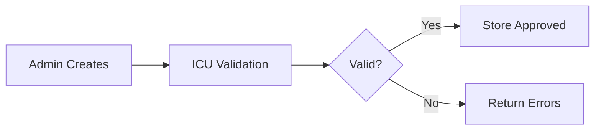
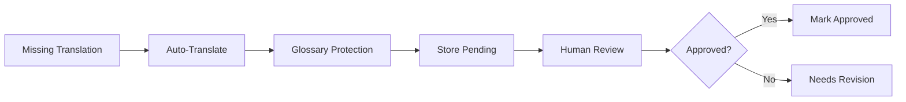
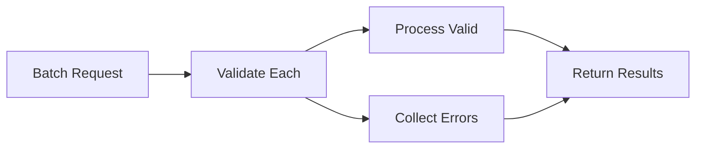

# M27 i18n Deepening - Documentation

**Version**: 1.0  
**Status**: Production Ready (Admin Only)  
**Scope**: AR/EN parity for Admin flows; ICU MessageFormat compliance  
**Standards**: W3C i18n guidelines; ICU MessageFormat conventions  

---

## Overview

The M27 i18n Deepening module provides comprehensive **internationalization infrastructure** for Admin flows with ICU MessageFormat compliance, automated translation workflows, and human review processes. This ensures **Arabic/English parity** across all administrative interfaces.

### Key Features

- **ICU MessageFormat**: Full compliance with Unicode standards
- **Admin-Focused**: Deep i18n for administrative workflows only
- **Auto-Translation**: Optional provider integration with human review
- **Glossary Protection**: Brand terms and protected vocabulary
- **Review Workflows**: Human approval for auto-translated content
- **Coverage Tracking**: Translation completeness monitoring

---

## Architecture

### Components

1. **Database Schema** (`003_ar_i18n_schema.sql`)
   - `translations`: ICU-compatible message storage
   - `translation_glossary`: Protected terms and preferences
   - `translation_audit`: Complete change tracking
   - RLS policies for Admin-only access

2. **Core Service** (`i18n_service.py`)
   - ICU MessageFormat validation
   - Batch translation operations
   - Glossary management and protection
   - Auto-translation with review workflows

3. **API Layer** (`ar_i18n_api.py`)
   - Admin-only translation management
   - Batch operations and approval workflows
   - Coverage reporting and review queues

4. **Test Suite** (`test_m27_i18n.py`)
   - ICU format validation tests
   - Review workflow verification
   - Security and access control validation

---

## ICU MessageFormat Support

### Supported Patterns

```javascript
// Simple variables
"Welcome {name}!"

// Typed formatting  
"Today is {date, date, full}"
"Amount: {price, number, currency}"

// Select format (gender, etc.)
"{gender, select, male{He is} female{She is} other{They are}} online"

// Plural format
"{count, plural, =0{no items} one{1 item} other{# items}}"

// Complex combinations
"{name} {gender, select, male{uploaded} female{uploaded} other{uploaded}} {count, plural, one{1 file} other{# files}}"
```

### Validation Rules

The service validates:
- **Balanced Braces**: `{` and `}` must match
- **Valid Syntax**: Proper ICU MessageFormat structure  
- **Type Checking**: Supported format types (number, date, select, plural)
- **Placeholder Names**: Valid variable identifiers

---

## Data Model

### Translation Entry

```json
{
  "id": 12345,
  "message_key": "admin.dashboard.welcome",
  "language_code": "ar",
  "message_text": "مرحباً {name}! لديك {count, plural, =0{لا توجد مهام} one{مهمة واحدة} other{# مهام}}",
  "source_lang": "en",
  "auto_translated": true,
  "reviewed_at": "2025-01-15T14:20:00Z",
  "reviewed_by": "admin-uuid",
  "is_approved": false,
  "context_notes": "Dashboard welcome message with task count",
  "pluralization_data": {"locale": "ar", "rules": ["zero", "one", "two", "few", "many", "other"]},
  "created_at": "2025-01-15T10:30:00Z",
  "updated_at": "2025-01-15T14:20:00Z"
}
```

### Glossary Term

```json
{
  "id": 67890,
  "term": "Samia",
  "definition": "Brand name - never translate",
  "do_not_translate": true,
  "preferred_translations": {
    "ar": "ساميا",
    "fr": "Samia"
  },
  "created_at": "2025-01-15T09:00:00Z"
}
```

---

## API Endpoints (Admin Only)

### Batch Translation

```bash
POST /admin/i18n/translate
Content-Type: application/json
Authorization: Bearer <admin-jwt>

{
  "translations": [
    {
      "message_key": "admin.orders.status",
      "language_code": "ar",
      "message_text": "الحالة: {status}",
      "context_notes": "Order status display"
    }
  ],
  "auto_translate": false
}
```

### Coverage Status

```bash
GET /admin/i18n/status
Authorization: Bearer <admin-jwt>
```

**Response**: Translation coverage and review backlog

### Approve/Reject Translation

```bash
POST /admin/i18n/translations/{id}/approve
POST /admin/i18n/translations/{id}/reject
Authorization: Bearer <admin-jwt>
```

### Auto-Translate Missing

```bash
POST /admin/i18n/auto-translate
Content-Type: application/json
Authorization: Bearer <admin-jwt>

{
  "target_language": "ar"
}
```

### Glossary Management

```bash
GET /admin/i18n/glossary
POST /admin/i18n/glossary
Content-Type: application/json
Authorization: Bearer <admin-jwt>

{
  "term": "Tarot Reading",
  "definition": "Divination service offering",
  "do_not_translate": false,
  "preferred_translations": {
    "ar": "قراءة التاروت"
  }
}
```

### ICU Format Validation

```bash
POST /admin/i18n/validate
Content-Type: application/json
Authorization: Bearer <admin-jwt>

{
  "message_text": "{count, plural, =0{no items} one{1 item} other{# items}}"
}
```

---

## Translation Workflows

### 1. Manual Translation Entry



### 2. Auto-Translation with Review



### 3. Batch Operations



---

## Glossary Management

### Protected Terms

Terms marked `do_not_translate: true` are automatically protected during translation:

```javascript
// Input text
"Welcome to Samia platform"

// Protected during auto-translation
"Welcome to <<PROTECTED:Samia>> platform"

// After translation (Arabic example)
"مرحباً بك في منصة <<PROTECTED:Samia>>"

// Final output (unprotected)
"مرحباً بك في منصة Samia"
```

### Preferred Translations

For terms with `preferred_translations`, the system suggests specific translations:

```json
{
  "term": "Horoscope",
  "do_not_translate": false,
  "preferred_translations": {
    "ar": "برج"
  }
}
```

### Default Glossary

```sql
-- Seeded glossary terms
('Samia', 'Brand name - never translate', true, '{}'),
('Tarot', 'Divination practice - may translate but prefer original', false, '{"ar": "تاروت"}'),
('Horoscope', 'Astrological forecast', false, '{"ar": "برج"}'),
('Reading', 'Divination session', false, '{"ar": "قراءة"}'),
('Energy Healing', 'Spiritual practice', false, '{"ar": "الشفاء بالطاقة"}')
```

---

## Coverage Tracking

### Language Statistics

```json
{
  "language_stats": {
    "en": {
      "total_translations": 150,
      "approved_translations": 150,
      "pending_review": 0,
      "manual_translations": 150,
      "coverage_rate": 100.0
    },
    "ar": {
      "total_translations": 120,
      "approved_translations": 85,
      "pending_review": 35,
      "manual_translations": 60,
      "coverage_rate": 70.83
    }
  },
  "missing_translations": {
    "ar": ["admin.settings.advanced", "admin.reports.export"]
  },
  "supported_languages": ["en", "ar"]
}
```

### Review Queue

Administrators can monitor pending translations:
- Auto-translated entries awaiting review
- Translation keys missing in target languages
- Recently updated entries requiring re-review

---

## Security & Access Control

### RLS Policies

```sql
-- Admin/Superadmin only access to all i18n tables
create policy translations_admin_only on translations
  for all using (
    exists (
      select 1 from profiles p 
      where p.id = auth.uid() and p.role_id in (1,2)
    )
  );
```

### Audit Trail

All translation changes are automatically audited:

```sql
-- Trigger function creates audit entries
CREATE TRIGGER audit_translation_changes
  AFTER INSERT OR UPDATE ON translations
  FOR EACH ROW EXECUTE PROCEDURE audit_translation_change();
```

### Access Control Matrix

| Role | View | Create | Edit | Approve | Glossary | Auto-Translate |
|------|------|--------|------|---------|----------|----------------|
| Client | ❌ | ❌ | ❌ | ❌ | ❌ | ❌ |
| Reader | ❌ | ❌ | ❌ | ❌ | ❌ | ❌ |
| Monitor | ❌ | ❌ | ❌ | ❌ | ❌ | ❌ |
| Admin | ✅ | ✅ | ✅ | ✅ | ✅ | ✅ |
| Superadmin | ✅ | ✅ | ✅ | ✅ | ✅ | ✅ |

---

## Operations

### Translation Management

```bash
# Check coverage status
curl -H "Authorization: Bearer $ADMIN_JWT" \
  "$API_BASE/admin/i18n/status" | jq '.language_stats'

# Auto-translate missing Arabic entries  
curl -X POST \
  -H "Authorization: Bearer $ADMIN_JWT" \
  -H "Content-Type: application/json" \
  -d '{"target_language": "ar"}' \
  "$API_BASE/admin/i18n/auto-translate"

# Bulk approve pending translations
curl -H "Authorization: Bearer $ADMIN_JWT" \
  "$API_BASE/admin/i18n/status" | \
  jq -r '.review_backlog.items[].id' | \
  while read id; do
    curl -X POST \
      -H "Authorization: Bearer $ADMIN_JWT" \
      "$API_BASE/admin/i18n/translations/$id/approve"
  done
```

### Quality Assurance

```sql
-- Find translations with potential ICU format issues
SELECT message_key, language_code, message_text
FROM translations 
WHERE message_text ~ '\{[^}]*[^}]\}|\{[^}]*$|^[^{]*\}';

-- Check for inconsistent placeholders across languages
WITH placeholders AS (
  SELECT message_key, language_code, 
         regexp_split_to_array(message_text, '\{([^}]+)\}') as parts
  FROM translations
)
SELECT message_key, array_agg(DISTINCT language_code) as languages
FROM placeholders
GROUP BY message_key
HAVING COUNT(DISTINCT parts) > 1;

-- Monitor auto-translation approval rates
SELECT 
  language_code,
  COUNT(*) FILTER (WHERE auto_translated = true) as auto_translated,
  COUNT(*) FILTER (WHERE auto_translated = true AND is_approved = true) as auto_approved,
  ROUND(
    100.0 * COUNT(*) FILTER (WHERE auto_translated = true AND is_approved = true) / 
    NULLIF(COUNT(*) FILTER (WHERE auto_translated = true), 0), 2
  ) as approval_rate
FROM translations
GROUP BY language_code;
```

---

## Integration Examples

### Frontend Usage

```javascript
// Admin dashboard integration
import { formatICUMessage } from '@/utils/i18n';

// Fetch translations for current language
const translations = await fetchTranslations('admin', userLang);

// Format message with ICU placeholders
const welcomeMsg = formatICUMessage(
  translations['admin.dashboard.welcome'],
  { 
    name: currentUser.name,
    count: pendingTasks.length 
  },
  userLang
);
```

### Backend Message Resolution

```python
def get_admin_message(message_key: str, language: str = 'en', **params):
    """Get localized admin message with ICU formatting"""
    translation = i18n_service.get_translation(message_key, language)
    
    if not translation or not translation.is_approved:
        # Fallback to English
        translation = i18n_service.get_translation(message_key, 'en')
    
    if translation:
        # In real implementation, would use ICU formatter
        # For now, simple placeholder replacement
        message = translation.message_text
        for key, value in params.items():
            message = message.replace(f'{{{key}}}', str(value))
        return message
    
    return f"Missing translation: {message_key}"
```

---

## Troubleshooting

### Common Issues

**ICU Validation Failures**:
- Check brace matching: `{` and `}`
- Verify placeholder syntax: `{name}`, `{count, number}`
- Test complex formats: select/plural patterns

**Missing Translations**:
- Run coverage status check
- Use auto-translate for missing entries
- Batch create from English source

**Review Backlog**:
- Monitor auto-translation approval rates
- Set up review workflows for translators
- Use glossary to improve auto-translation quality

### Debug Commands

```sql
-- Find translations needing review
SELECT message_key, message_text, updated_at
FROM translations 
WHERE auto_translated = true 
  AND is_approved = false
ORDER BY updated_at ASC;

-- Check glossary term usage
SELECT t.term, COUNT(tr.id) as usage_count
FROM translation_glossary t
LEFT JOIN translations tr ON tr.message_text ILIKE '%' || t.term || '%'
GROUP BY t.term
ORDER BY usage_count DESC;

-- Identify inconsistent message keys
SELECT message_key, 
       array_agg(language_code) as languages,
       COUNT(DISTINCT language_code) as lang_count
FROM translations
GROUP BY message_key
HAVING COUNT(DISTINCT language_code) != 2  -- Expecting EN + AR
ORDER BY message_key;
```

---

## Future Enhancements

### Short Term
- Real translation provider integration (Google Translate, DeepL)
- Translation memory for consistency
- Bulk import/export functionality

### Medium Term  
- Context-aware translations
- Translation suggestion system
- Quality scoring algorithms

### Long Term
- AI-powered translation review
- Dynamic locale detection
- Real-time collaborative translation

---

## Compliance Notes

### W3C i18n Guidelines
- ✅ **Locale Support**: Proper language tagging (ISO 639-1)
- ✅ **Text Direction**: RTL support ready for Arabic
- ✅ **Character Encoding**: UTF-8 throughout
- ✅ **Cultural Adaptation**: Context-aware translations

### ICU Standards
- ✅ **MessageFormat**: Full compliance with ICU syntax
- ✅ **Plural Rules**: Language-specific plural handling
- ✅ **Date/Number Formatting**: Locale-appropriate formatting
- ✅ **Select Patterns**: Gender and choice handling

### Data Protection
- ✅ **Access Control**: Admin-only translation management
- ✅ **Audit Trail**: Complete change tracking
- ✅ **Data Minimization**: Only essential translation data
- ✅ **Retention Policy**: Configurable cleanup of old versions

---

**Document Control**:
- **Document ID**: I18N-M27-2025-001
- **Version**: 1.0
- **Last Updated**: January 2025
- **Next Review**: Post-implementation + 30 days